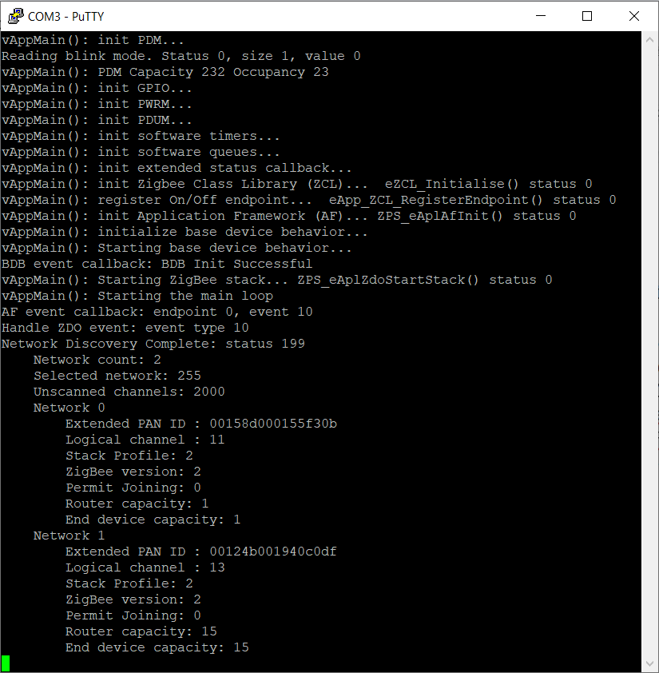
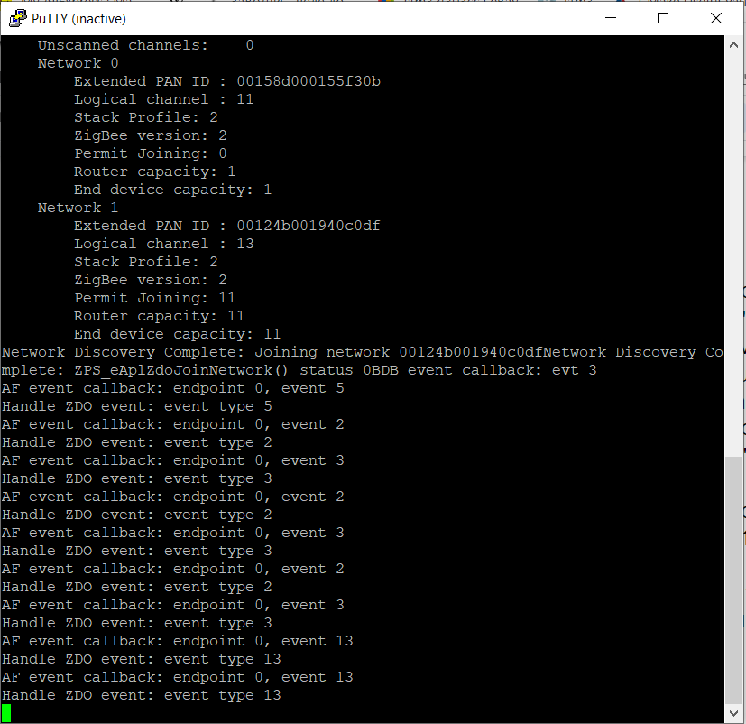
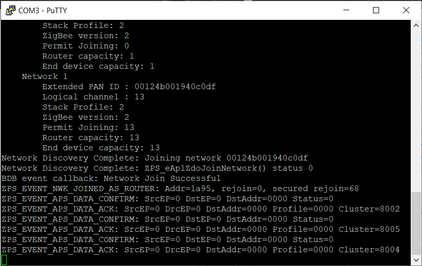
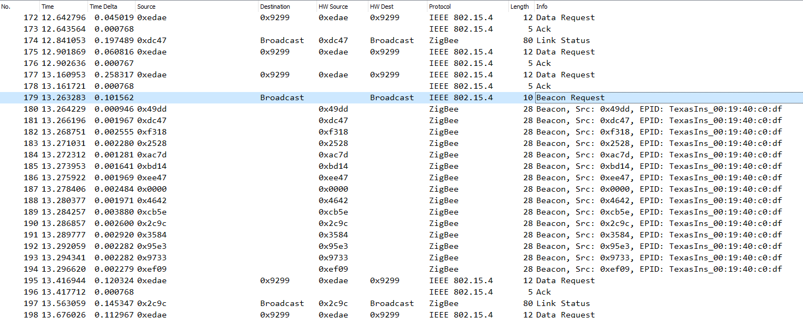
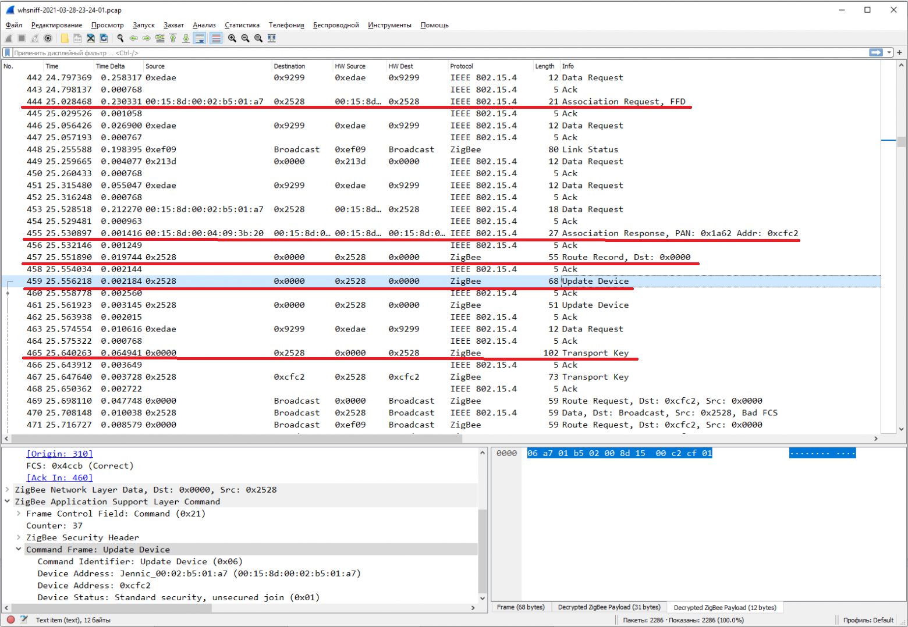
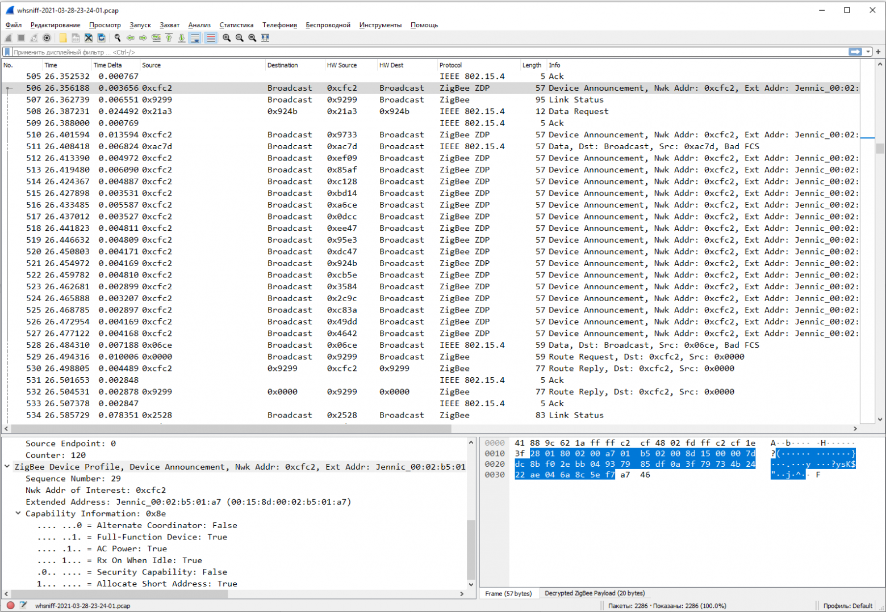
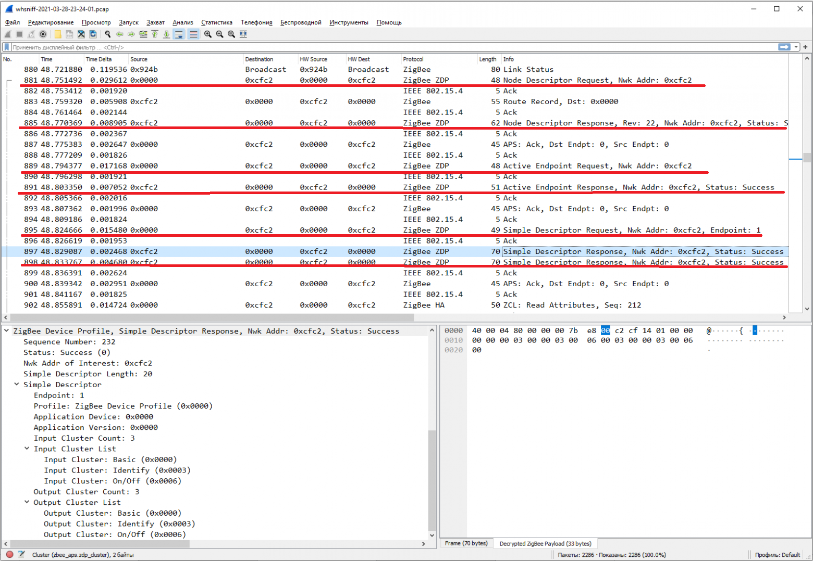

# Hello Zigbee World, Part 6 - Joining Zigbee Network

Zigbee devices operate in a Zigbee network. But in order to get to the network, the device must join this network first. This article describes a simple device joining process. The described process is not very correct in terms of Zigbee specification (we will fix this later), but is a great step in understanding Zigbee networks in practice. Also this article aimed to describe the event based approach used in the firmware.

Overall this article is a part of the [Hello Zigbee series](part0_plan.md), describing building a Zigbee device firmware from scratch. By this time we have a [working LED blinker](part1_bring_up.md), ready to be integrated with Zigbee. The firmware [performs Zigbee stack initialization](part5_zigbee_init.md), and is ready to communicate with the Zigbee network.

The hardware setup is described in the [very first article](part0_plan.md), and is based on the EBYTE E75–2G4M10S module (NXP 5169 microcontroller). The toolchain and basic MCU peripherals were also described in the article.

## Joining the network

So, we have the application skeleton, and the ZigBee stack is linked and initialized. But the device still does not interact with the network in any way. Let's try to connect to the network. Remember the `zps_eAplZdoStartStack()` function, which is recommended by the documentation but not used in the examples from NXP? As per function documentation, it starts the ZigBee stack and initiates the device connection to the network.

I think the poke method is a very good way to learn something new. Let's try to make a call to zps_eAplZdoStartStack() just before starting the main device loop.

```cpp
   // Start ZigBee stack
   DBG_vPrintf(TRUE, "vAppMain(): Starting ZigBee stack... ");
   status = ZPS_eAplZdoStartStack();
   DBG_vPrintf(TRUE, "ZPS_eAplZdoStartStack() status %d\n", status);
```

Let's run the code and see the following lines in console

```
...
vAppMain(): Starting base device behavior...
BDB event callback: BDB Init Successful
vAppMain(): Starting ZigBee stack... ZPS_eAplZdoStartStack() status 0
vAppMain(): Starting the main loop
BDB event callback: evt 1
```

The last line is printed in about a second after the start of the main loop. Looks like the device is doing something, then an event occurs, and the SDK calls our `APP_vBdbCallback()` handler function. Let's check out the list of BDB events in the `bdb_api.h` file and search for event number 1 - it appears to be the `BDB_EVENT_ZPSAF` event. Apparently the BDB wants to tell us that something interesting happened in the Application Framework (AF) module.

The example code from NXP is implemented in a set of various event handlers, every single function handles a specific event. My firmware will be structured in a similar way, and also have a bunch of different event handlers. All those handlers may look overwhelming at first. But when you write it yourself, you begin to understand the structure of the application much better. Let's handle the `BDB_EVENT_ZPSAF` event.

```cpp
PUBLIC void APP_vBdbCallback(BDB_tsBdbEvent *psBdbEvent)
{
   switch(psBdbEvent->eEventType)
   {
       case BDB_EVENT_ZPSAF:
           vAppHandleAfEvent(&psBdbEvent->uEventData.sZpsAfEvent);
           break;
...
```

The `psBdbEvent` data structure contains a union carrying the event data. It is handy to unwrap the data here, and pass it to the AF event handler. The handler function will be quite simple at this point.

```cpp
PRIVATE void vAppHandleAfEvent(BDB_tsZpsAfEvent *psZpsAfEvent)
{
   DBG_vPrintf(TRUE, "AF event callback: endpoint %d, event %d\n", psZpsAfEvent->u8EndPoint, psZpsAfEvent->sStackEvent.eType);

   if(psZpsAfEvent->u8EndPoint == HELLOZIGBEE_ZDO_ENDPOINT)
   {
       // events for ep 0
       vAppHandleZdoEvents(psZpsAfEvent);
   }
}
```

Let's figure out what's going on here. The AF event is targeted to some endpoint. Jumping ahead a little, I already checked that this particular event is targeted for the Zigbee Device Object (ZDO) that resides on the endpoint #0 (`HELLOZIGBEE_ZDO_ENDPOINT`). These events will be handled by a dedicated handler - `vAppHandleZdoEvents()`. I spied that the event that we are now considering is `ZPS_EVENT_NWK_DISCOVERY_COMPLETE`.

```cpp
PRIVATE void vAppHandleZdoEvents(BDB_tsZpsAfEvent *psZpsAfEvent)
{
   DBG_vPrintf(TRUE, "Handle ZDO event: event type %d\n", psStackEvent->eType);

   switch(psStackEvent->eType)
   {
       case ZPS_EVENT_NWK_DISCOVERY_COMPLETE:
           vHandleDiscoveryComplete(&psStackEvent->uEvent.sNwkDiscoveryEvent);
           break;
       default:
           break;
   }
}
```

Now it becomes a little clearer what is happening. The `zps_eAplZdoStartStack()` function tries to connect to a network. Since the device does not know any network, the network discovery procedure is started. The device sends a broadcast request "Is there anybody here?" and waits for the network devices in the area to answer "I'm here!". In about a second, the discovery procedure is completed, and the ZigBee stack sends us a `ZPS_EVENT_NWK_DISCOVERY_COMPLETE` message with a list of found networks. Let's just print this data for now.

```cpp
PRIVATE void vHandleDiscoveryComplete(ZPS_tsAfNwkDiscoveryEvent * pEvent)
{
   DBG_vPrintf(TRUE, "Network Discovery Complete: status %d\n", pEvent->eStatus);
   DBG_vPrintf(TRUE, "    Network count: %d\n", pEvent->u8NetworkCount);
   DBG_vPrintf(TRUE, "    Selected network: %d\n", pEvent->u8SelectedNetwork);
   DBG_vPrintf(TRUE, "    Unscanned channels: %4x\n", pEvent->u32UnscannedChannels);

   for(uint8 i = 0; i < pEvent->u8NetworkCount; i++)
   {
       DBG_vPrintf(TRUE, "    Network %d\n", i);

       ZPS_tsNwkNetworkDescr * pNetwork = pEvent->psNwkDescriptors + i;

       DBG_vPrintf(TRUE, "        Extended PAN ID : %016llx\n", pNetwork->u64ExtPanId);
       DBG_vPrintf(TRUE, "        Logical channel : %d\n", pNetwork->u8LogicalChan);
       DBG_vPrintf(TRUE, "        Stack Profile: %d\n", pNetwork->u8StackProfile);
       DBG_vPrintf(TRUE, "        ZigBee version: %d\n", pNetwork->u8ZigBeeVersion);
       DBG_vPrintf(TRUE, "        Permit Joining: %d\n", pNetwork->u8PermitJoining);
       DBG_vPrintf(TRUE, "        Router capacity: %d\n", pNetwork->u8RouterCapacity);
       DBG_vPrintf(TRUE, "        End device capacity: %d\n", pNetwork->u8EndDeviceCapacity);
   }
}
```

I know that it may be difficult to get even such a simple piece of code for the first time. So let me briefly summarize the essence of the last few pieces of code. We received a message from BDB in the `APP_vBdbCallback()` handler. We saw that this message came from the Application Framework, so we sent it to the `vAppHandleAfEvent()` handler. There we realized that this was a message for the endpoint zero (ZDO) and routed it to `vAppHandleZdoEvents()` for processing. And, finally, we figured out exactly what message has arrived (`ZPS_EVENT_NWK_DISCOVERY_COMPLETE`), and processed it in the `vHandleDiscoveryComplete()` function. Please note that this was just a single message propagated through the code. And all the handling we did is dumping message contents.

Running this in hardware, we see the following picture.



In addition to the main network, I also turned on my Xiaomi Zigbee Hub. Surprisingly the device found both networks, and the parameters (channel number, and PAN ID) match the real ones.

What else interesting did the Discovery Complete message bring us? Particularly I am interested in the Selected Network parameter. The ZigBee stack analyzed both networks discovered, and decided that it would not be possible to connect to either of them right away. That is because neither network accepts new devices at the moment. But if we enable the Permit Join mode on the coordinator, the Selected Network parameter turns into a network index (index in the list of networks). Thus, we have the ID of a network that we can theoretically connect to. Let's try to do this by calling `ZPS_eAplZdoJoinNetwork()`.

```cpp
PRIVATE void vHandleDiscoveryComplete(ZPS_tsAfNwkDiscoveryEvent * pEvent)
{
...
   // Check if there is a suitable network to join
   if(pEvent->u8SelectedNetwork == 0xff)
   {
       DBG_vPrintf(TRUE, "    No good network to join\n");
       return;
   }

   // Join the network
   ZPS_tsNwkNetworkDescr * pNetwork = pEvent->psNwkDescriptors + pEvent->u8SelectedNetwork;
   DBG_vPrintf(TRUE, "Network Discovery Complete: Joining network %016llx\n", pNetwork->u64ExtPanId);
   ZPS_teStatus status = ZPS_eAplZdoJoinNetwork(pNetwork);
   DBG_vPrintf(TRUE, "Network Discovery Complete: ZPS_eAplZdoJoinNetwork() status %d", status);
}
```

In my smart home system, I use a CC2538 USB stick in conjunction with [zigbee2mqtt (Z2M)](https://zigbee2mqtt.io/) as a coordinator. Let's take a look at Z2M logs. 0x00158d0002b501a7 is my device MAC address, so we can just filter log messages to show only relevant messages.

```
grafalex@SmartHome:~/SmartHome/zigbee2mqtt/log/2021-03-25.23-48-31$ cat log.txt | grep 0x00158d0002b501a7
info  2021-03-28 22:00:41: Device '0x00158d0002b501a7' joined
info  2021-03-28 22:00:41: MQTT publish: topic 'zigbee2mqtt/bridge/event', payload '{"data":{"friendly_name":"0x00158d0002b501a7","ieee_address":"0x00158d0002b501a7"},"type":"device_joined"}'
info  2021-03-28 22:00:41: Starting interview of '0x00158d0002b501a7'
info  2021-03-28 22:00:41: MQTT publish: topic 'zigbee2mqtt/bridge/event', payload '{"data":{"friendly_name":"0x00158d0002b501a7","ieee_address":"0x00158d0002b501a7","status":"started"},"type":"device_interview"}'
info  2021-03-28 22:00:41: MQTT publish: topic 'zigbee2mqtt/bridge/log', payload '{"message":{"friendly_name":"0x00158d0002b501a7"},"type":"device_connected"}'
info  2021-03-28 22:00:41: MQTT publish: topic 'zigbee2mqtt/bridge/log', payload '{"message":"interview_started","meta":{"friendly_name":"0x00158d0002b501a7"},"type":"pairing"}'
info  2021-03-28 22:00:42: MQTT publish: topic 'zigbee2mqtt/bridge/event', payload '{"data":{"friendly_name":"0x00158d0002b501a7","ieee_address":"0x00158d0002b501a7"},"type":"device_announce"}'
info  2021-03-28 22:00:42: MQTT publish: topic 'zigbee2mqtt/bridge/log', payload '{"message":"announce","meta":{"friendly_name":"0x00158d0002b501a7"},"type":"device_announced"}'
info  2021-03-28 22:04:16: Successfully interviewed '0x00158d0002b501a7', device has successfully been paired
warn  2021-03-28 22:04:16: Device '0x00158d0002b501a7' with Zigbee model 'undefined' and manufacturer name 'undefined' is NOT supported, please follow https://www.zigbee2mqtt.io/how_tos/how_to_support_new_devices.html
info  2021-03-28 22:04:16: MQTT publish: topic 'zigbee2mqtt/bridge/event', payload '{"data":{"definition":null,"friendly_name":"0x00158d0002b501a7","ieee_address":"0x00158d0002b501a7","status":"successful","supported":false},"type":"device_interview"}'
info  2021-03-28 22:04:16: MQTT publish: topic 'zigbee2mqtt/bridge/log', payload '{"message":"interview_successful","meta":{"friendly_name":"0x00158d0002b501a7","supported":false},"type":"pairing"}'
```

Zigbee2mqtt discovered our device and tried to chat with it. But since almost nothing is implemented on the device side, the interview ended pretty quickly. Z2M said that the device is alive, but it does not yet know how to communicate with the device. This is expected at this point.

## Device Joining in details

Let's see what happens from the side of the device (I apologize for the crookedly spaced line feeds).



Looks like we received AF messages 2, 3, 5, and 13, which corresponds to `ZPS_EVENT_APS_DATA_CONFIRM`, `ZPS_EVENT_APS_DATA_ACK`, `ZPS_EVENT_NWK_JOINED_AS_ROUTER`, and `ZPS_EVENT_NWK_STATUS_INDICATION`. We also need to process BDB message number 3 (`BDB_EVENT_REJOIN_SUCCESS`). Let's go figure it out.

I've added debug prints to all of these events. There is no message processing in the code below, just dumping the data.

```cpp
PRIVATE void vHandleDataConfirm(ZPS_tsAfDataConfEvent * pEvent)
{
   DBG_vPrintf(TRUE, "ZPS_EVENT_APS_DATA_CONFIRM: SrcEP=%d DstEP=%d DstAddr=%04x Status=%d\n",
           pEvent->u8SrcEndpoint,
           pEvent->u8DstEndpoint,
           pEvent->uDstAddr.u16Addr,
           pEvent->u8Status);
}

PRIVATE void vHandleDataAck(ZPS_tsAfDataAckEvent * pEvent)
{
   DBG_vPrintf(TRUE, "ZPS_EVENT_APS_DATA_ACK: SrcEP=%d DrcEP=%d DstAddr=%04x Profile=%04x Cluster=%04x\n",
               pEvent->u8SrcEndpoint,
               pEvent->u8DstEndpoint,
               pEvent->u16DstAddr,
               pEvent->u16ProfileId,
               pEvent->u16ClusterId);
}

PRIVATE void vHandleJoinedAsRouter(ZPS_tsAfNwkJoinedEvent * pEvent)
{
   DBG_vPrintf(TRUE, "ZPS_EVENT_NWK_JOINED_AS_ROUTER: Addr=%04x, rejoin=%d, secured rejoin=%d\n",
               pEvent->u16Addr,
               pEvent->bRejoin,
               pEvent->bSecuredRejoin);
}

PRIVATE void vHandleNwkStatusIndication(ZPS_tsAfNwkStatusIndEvent * pEvent)
{
   DBG_vPrintf(TRUE, "ZPS_EVENT_NWK_STATUS_INDICATION: Addr:%04x Status:%02x\n",
       pEvent->u16NwkAddr,
       pEvent->u8Status);
}

PRIVATE void vAppHandleZdoEvents(ZPS_tsAfEvent* psStackEvent)
{
   switch(psStackEvent->eType)
   {
   case ZPS_EVENT_APS_DATA_CONFIRM:
           vHandleDataConfirm(&psStackEvent->uEvent.sApsDataConfirmEvent);
           break;
   case ZPS_EVENT_APS_DATA_ACK:
       vHandleDataAck(&psStackEvent->uEvent.sApsDataAckEvent);
       break;

   case ZPS_EVENT_NWK_JOINED_AS_ROUTER:
       vHandleJoinedAsRouter(&psStackEvent->uEvent.sNwkJoinedEvent);
       break;

   case ZPS_EVENT_NWK_STATUS_INDICATION:
       vHandleNwkStatusIndication(&psStackEvent->uEvent.sNwkStatusIndicationEvent);
       break;

   case ZPS_EVENT_NWK_DISCOVERY_COMPLETE:
       vHandleDiscoveryComplete(&psStackEvent->uEvent.sNwkDiscoveryEvent);
       break;

   default:
       DBG_vPrintf(TRUE, "Handle ZDO event: event type %d\n", psStackEvent->eType);
       break;

   }
}

PUBLIC void APP_vBdbCallback(BDB_tsBdbEvent *psBdbEvent)
{
   switch(psBdbEvent->eEventType)
   {
...
   case BDB_EVENT_REJOIN_SUCCESS:
       DBG_vPrintf(TRUE, "BDB event callback: Network Join Successful\n");
       break;
...
   }
}
```

Trying to re-compile and take off and... nothing happens. That is because we have already connected to the network, and the `ZPS_eAplZdoStartStack()` function stored this fact in the EEPROM. At the next start, this function recalls that the device has already joined the network and does nothing. Let's try to somehow reset the device's network settings before running `ZPS_eAplZdoStartStack()`.

```cpp
   // Reset Zigbee stack to a very default state
   ZPS_vDefaultStack();
   ZPS_vSetKeys();
   ZPS_eAplAibSetApsUseExtendedPanId(0);
```

Yes, the device will reconnect to the network on every boot, but we will deal with this later. By the way, on the zigbee2mqtt side, you also need to remove the device from the network by sending a message to the `zigbee2mqtt/bridge/request/device/remote` topic with the content `{"id":"0x00158d0002b501a7", "force":true}` (or delete the device via the Z2M dashboard, checking the ‘force remove' box)

After some polishing, the network joining process looks something like this.



Let's find out what's going on here.

First of all, we are told that the device has joined the network. Then it is followed by a series of `DATA_CONFIRM` and `DATA_ACK` events. If we look at the documentation we can learn that

- `DATA_CONFIRM` means the device has sent a data packet and this packet was delivered to the next hop node in the route (the node acknowledged the packet)
- The packet then is transmitted to the final recipient (probably the packet has to jump over the several hops to the recipient).
- When the packet reaches the final recipient, it confirms data reception with the `DATA_ACK` event (ACK packet was delivered by the reverse route through several intermediate nodes)

So we see confirmation of sending some messages (our device sends some data), but we don't see the messages themselves. Moreover, we do not see events that are processed by the ZigBee stack. they didn't even get to the application level - just processed internally by the Zigbee layer, and we see only confirming the answers.

## Sniffing Zigbee

Let's uncover the sniffer - it will reveal real data transferred between nodes. Also seeing real packets allows much better understanding of how Zigbee network works. I am using an old CC2531 dongle, [whsniff](https://github.com/homewsn/whsniff) or [ZBOSS](https://www.zigbee2mqtt.io/advanced/zigbee/04_sniff_zigbee_traffic.html) for packet capture, and [wireshark](https://www.wireshark.org/) for analysis. Let's repeat the network joining process and see how it looks on the packet level.

Zigbee operates with short messages between network nodes. Each node has a 16-bit network address, so it is easy to identify who is the sender, and who is the receiver. The node that is about to join does not have a network address, and can only send broadcast messages.

When the firmware calls `ZPS_eAplZdoStartStack()` function, and the device is not yet on the network, Zigbee stack starts the network discovery procedure. This is how it looks on the network level.



Here we see that our device sends a Beacon Request (highlighted packet), asking if there are any Zigbee devices operating somewhere around. in turn several router devices nearby respond to our device. Here we see only what is happening on the main channel of my ZigBee network. In fact, a similar Beacon Request was sent to other channels, and there were also similar responses (for example, from my Xiaomi gateway operating on the different channel). This is exactly what the network discovery procedure looks like at the network level. Within about one second, the network discovery function collects responses from different networks, after that SDK sends us a `ZPS_EVENT_NWK_DISCOVERY_COMPLETE` message with a list of discovered networks..

As you remember, then we called the `ZPS_eAplZdoJoinNetwork()` function. In the sniffer network joining looks like this.



There are several important things happening here.

- The device sends an Association request. By this time, our device does not yet have a 16-bit network logical address, so it uses the full MAC address (0x00158d0002b501a7). Typically the joining device selects the nearest router with the best signal strength. In this case it selected a router with address 0x2528.
- The router responds with an Association Response message, and assigns the address 0xcfc2 to our device
- The router sends several messages to the coordinator: there is a new route to the new device 0xcfc2, and the device 0xcfc2 has joined the network (Update device)
- At this point, encryption is not yet enabled, so the coordinator sends the network transport key to the new device. Moreover, this message is not direct, but goes through a 2-hop route - 0x0000 -> 0x2528 -> 0xcfc2 (the sniffer sees both messages)
- Then a wave of messages begins between all routers on the network informing that a route to the new device has been found, and the route tables need to be updated (there were a lot of these messages, I did not take a screenshot)
- Then another wave of Device Announcement messages rolls through the network, indicating device type and device capabilities (for example, the device is a Fully Functional Device with a constant power)



With the last message the Zigbee network becomes aware of the new device, Technically the device is now a member of the network, but the coordinator needs to have some more information. Thus the coordinator begins an interview process, and starts sending the device number of requests.



And here we see 3 requests from the coordinator, and 3 corresponding responses. These are the messages that we saw confirmations in the console - Node Descriptor, Active Endpoint, and Simple Descriptor. We'll take a detailed look at them in the next article. Processing of these requests happens automatically, and no specific code needed from the firmware side.

## Summary

From this point the device becames a fully-featured member of the network. Other devices know the route to this device, and the device also can act as a transit node. In the next articles we will teach the device to communicate with the coordinator and properly register itself in zigbee2mqtt.

In this article I described the simplest possible process to join the network. But the biggest takeaways from this article are:

- The firmware operates with a concept of events, which are handled by dedicated handlers. Some event handlers may delegate processing to lower level handlers. Most of the firmware development will end up adding handlers to other events.
- Looking at the firmware code is not enough to understand how the Zigbee network works. Using a sniffer and Wireshark provides much more visibility of how the network really works, how messages are transmitted over the network, and what their payload is.


## Links:
- [Project on github](https://github.com/grafalex82/hellozigbee/tree/hello_zigbee_part_1)
- Documentation
  - https://www.nxp.com/docs/en/user-guide/JN-UG-3113.pdf
  - https://www.nxp.com/docs/en/user-guide/JN-UG-3116.pdf
  - https://www.nxp.com/docs/en/user-guide/JN-UG-3087.pdf
  - [How to sniff Zigbee traffic](https://www.zigbee2mqtt.io/advanced/zigbee/04_sniff_zigbee_traffic.html)
- Example code
  - JN-AN-1220-Zigbee-3–0-Sensors example (recommended)
  - JN-AN-1219-Zigbee-3–0-Controller-and-Switch example (somewhat sophisticated for learning purposes)
  - https://github.com/actg/JN5169-for-xiaomi-wireless-switch.git